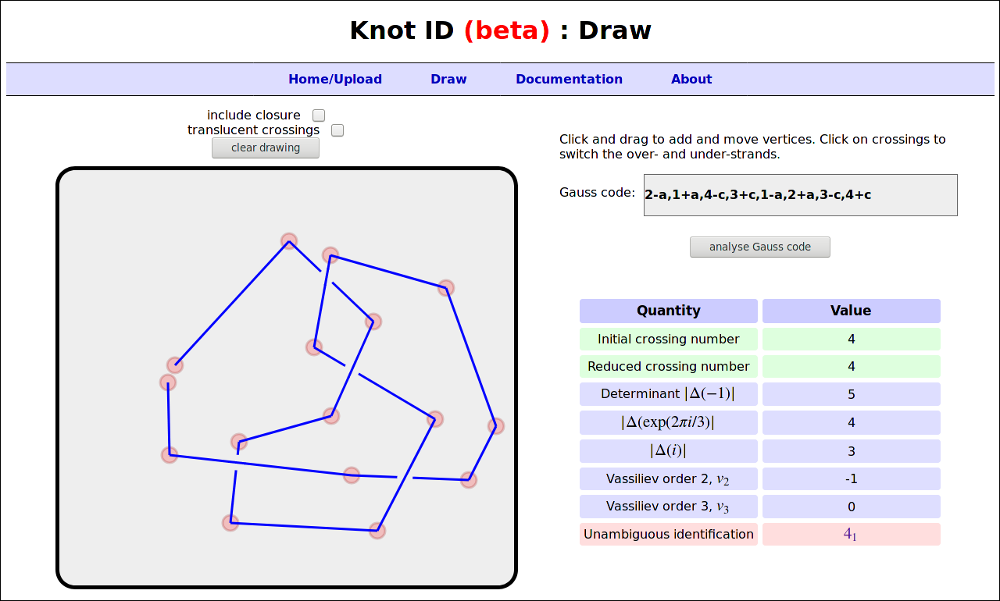

# Knot ID

Knot ID is a website for analysing the knot type of curves, which can be uploaded in different ways including via a drawing interface, as sets of points, or via standard topological notations.

The website can be viewed at http://inclem.net/knotidentifier/.

Knot ID is developed as part of the [Scientific Properties of Complex Knots (SPOCK) Programme Grant](http://www.maths.dur.ac.uk/spock/index.html/), a collaboration between Durham University and the University of Bristol, funded by the Leverhulme Trust.

## Run Knot ID

To run Knot ID locally, install [pyknotid](https://github.com/SPOCKnots/pyknotid), clone this repository, and run:

    $ python main.py

## Technical details

Knot ID is written in Python using the Flask framework. Topological
analysis is carried out using
the [pyknotid Python library](https://github.com/SPOCKnots/pyknotid),
also developed under the SPOCK Programme Grant.

